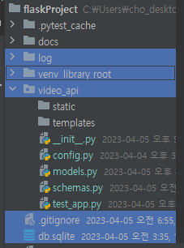
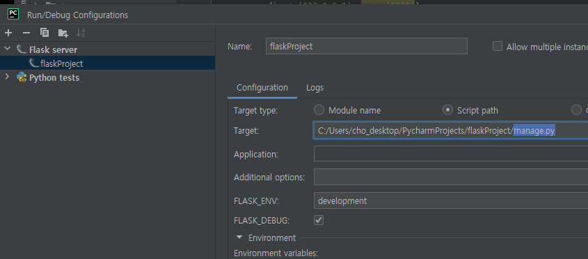
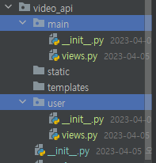
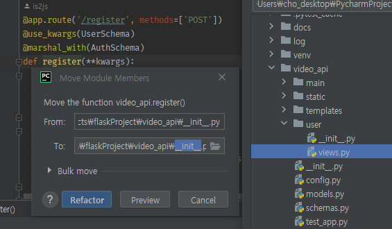
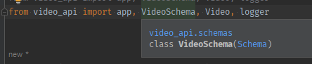
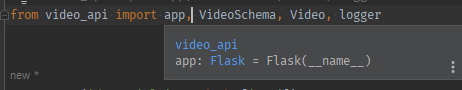

1. **root에 `video_api`폴더를 만들고, `log, db.sqlite, venv`관련파일을 제외하고 다 옮긴다**
    - 


2. 모듈로서, (예비)manage.py에 `video_api모듈 import`시 자동실행 되어야할 `app.py`를 -> `__init__.py`로 이름을 변경한다
   - 이 때, Rename시 [ ] search for reference를 체크하고 바꿔주자.
   - `app.py`를 `from app`으로 쓰고 있던 것들이 -> `from __init__`으로 바뀜.

3. video_api 모듈안 의 **models.py, test_app.py 등의 `from __init__`을 `from . `으로 변경해주자**
  - `from .`은 현재모듈내 `__init__.py`에 선언된 것에서 가져온다는 뜻이다.
  - **이제 backend모듈 안에 있는, 각각의 모듈들은 `__init__.py`에 선언된 변수들을 사용할 땐 `from . import xx`로 가져와 쓴다.**
    - 순환참조를 막으려면 init안에서는 선언된 변수보다 더 아래에서 하위모듈들을 import해야한다.
  ```python
  # models.py
  from . import db, session, Base
     
  # test_app.py
  from . import client
  ```

4. video_api 모듈의 `__init__.py`는 **하위 aa.py, bb.py 모듈들을 `from .aa import`로 변경해야한다.**
   - `from config ` -> `from .config`
   - 하나의 모듈 backend내부에 포함된 순간, 각각의 xx.py는 이름의 이름의 의미를 읽게 되며, **`init의 from .xx import`로 가져와서 한번에 사용된다.**
   ```python
    # before(app.py)
    from config import Config
    from schemas import VideoSchema, UserSchema, AuthSchema
   
    from models import *
   
    # after(__init__.py)
    from .config import Config
    from .schemas import VideoSchema, UserSchema, AuthSchema
   
    from .models import Video, User
   
    ```
     
5. **root에서 app객체를 가진 backend모듈을 import해서 관리할 `manage.py`를 생성한다**
    - backend의 init에 선언된 app객체를 import해오자.
    - init.py에 선언된 app객체 실행로직도 잘라내기로 가져오자.
   ```python
    # manage.py
    from video_api import app
    
    if __name__ == '__main__':
        app.run(host='127.0.0.1', port='5000', debug=True)
    ```


5. 이제 flask 실행을 `python manage.py`로 실행하며, **파이참에서는 edit하여 app.py -> manage.py로 변경해준다**
    
   ```python
   python manage.py
   ```
   
6. 이제 각 도메인별(main, user) `Python Package(폴더+init)`을 만들어준다.
   - 현재는 video를 보여주는 것이 main에서 할 일이므로 main으로 잡아준다.
   - **추가로 각 route들을 위치시킬 `views.py`도 만들어준다.**
      

7. **video_api의 init속의 route들을 각 모듈의 views.py로 옮겨준다.**
   - route가 2개 밖에 없는 user관련 route들부터 옮겨주기
   - `video_api/__init__.py` -> `video_api/user/views.py`
      
   - **하위모듈(user/views.py)에서 상위모듈(init.py)를 가져다 쓸 땐, `from root모듈부터`가져다 쓴다.**
      - 앞에서는 같은 모듈내init.py -> `from . import`으로 가져다 썼고
      - 상위에서 하위모듈을 쓸 땐 -> `from .하위모듈명 import`로 가져다 썼지만
      - 하위에서 상위모듈 쓸 땐 -> `from root부터 import`하자
   ```python
   from flask_apispec import use_kwargs, marshal_with
   # 하위에서 상위모듈을 끌어다 쓸 땐, root부터 경로 적어주기
   from video_api import app, UserSchema, AuthSchema, User, logger
   
   
   @app.route('/register', methods=['POST'])
   @use_kwargs(UserSchema)
   @marshal_with(AuthSchema)
   def register(**kwargs):
       try:
           user = User(**kwargs)
           user.save()
           token = user.get_token()
       except Exception as e:
           logger.warning(
               f'registration failed with errors: {e}'
           )
           return {'message': str(e)}, 400
       return {'access_token': token}
   
   @app.route('/login', methods=['POST'])
   @use_kwargs(UserSchema(only=('email', 'password')))  # only 미작성시 register payload기준에 못미쳐서 422 뜸.
   @marshal_with(AuthSchema)
   def login(**kwargs):
       try:
           user = User.authenticate(**kwargs)
           token = user.get_token()
       except Exception as e:
           logger.warning(
               f'login with email{kwargs["email"]} failed with errors: {e}'
           )
           return {'message': str(e)}, 400
       return {'access_token': token}

   ```
   - **이렇게 자동으로 모듈 import를 반영했더니 에러가 난다.**
      ```
      ImportError: cannot import name 'app' from partially initialized module 'video_api' (most likely due to a circular import) (C:\Users\cho_desktop\PycharmProjects\flaskProject\video_api\__init__.py)
      ```
   - 사실 하위모듈에 작성된 코드를 상위모듈을 작성시작부터 import해서 작성하는 것이 모듈 방식인데
      - 하위모듈을 import한 후, 상위모듈 내용 작성시, 하위모듈이 이미 상위모듈 작성을 가정하고 가져다 썼기 때문이다.
      ```python
      # 상위 작성 시작 전, 하위를 가져다 씀.
      from .user.views import register, login
      
      app = Flask(__name__)
      ```
      ```python
      # 하위모듈에서는 작성되지도 않은 상위모듈을 끌어서 route를 작성하고 있음.
      from video_api import app, UserSchema, AuthSchema, User, logger
      ```
     

8. **하위모듈 작성시, 상위모듈의 객체들을 끌어다 쓰게 된다면(route이동시 자연발생), 상위모듈 내에서, (하위가 끌어다 쓰이는) 상위의 객체 생성후 하위모듈이 import되도록 변경한다**
    - 동급모듈은 init일 경우, `from . import`로 시행/ 다른모듈일 경우 `from root부터.동급레벨 import`로 한다면 괜찮다.
       - Schema류 -> `from 상위모듈.schemas import ` 
       - Model류 -> `from 상위모듈.models import ` 
    - 하지만 상위모듈의 객체를 끌어다 쓴다면, **상위모듈은 하위모듈을 import할 건데, 상위모듈내 객체 생성후 하위모듈import**되도록 변경해야한다.
       - app, logger
    ```python
    # user/views.py
    
    # from video_api import app, UserSchema, AuthSchema, User, logger
    
    # 2. 나를 갖다쓰는 상위모듈의 객체 import -> 상위객체 생성후 나를 갖다쓰도록 import 위치 변경해야함.
    from video_api import app, logger
    
    # 1. 나를 갖다쓰지 않는 상위모듈의 하위 타모듈의 객체 import -> 그냥 상위부터 import해서 사용
    from video_api.schemas import UserSchema, AuthSchema
    from video_api.models import User
    ```

9. **상위모듈의 객체 app, logger를 import했으니, 상위모듈의 객체 생성 이후에 나(하위모듈)를 import하도록, 변경해주자.**
- 기존: 하위에서 갖다쓰는 app, logger객체 생성보다 이전에 import 되었다.(pycharm 자동)
    ```python
    from .user.views import register, login
    #...
    app = Flask(__name__)
    # ...
    #...
    logger = setup_logger()
    docs.register(register)
    docs.register(login)
    ```
- 변경: **나의 객체를 갖다써서 정의되는 하위모듈의 import는, `나의 객체 생성이후 && 갖다쓰기 직전에 import해준다`**
    
    ```python
    #...
    app = Flask(__name__)
    #...
    logger = setup_logger()
    #...
    from .user.views import register, login
    # docs register view_functions
    #...
    docs.register(register)
    docs.register(login)
    ```


10. **하위모듈에 정의된 `route view_func들`을 Blueprint로 통합할 수 있다**
    - 현재 상위모듈에서, 하위모듈의 route view func들이 개별적으로 import되는데, **이 route func들을 하위모듈내 1개의 객체로 통합해주는 것이 bp이다.**
    - 상위모듈의 app import를 제거하고, bp `users`를 만든 다음 @app 대신 @users.route를 사용한다
    ```python
    # users/views.py
    from flask import Blueprint
    
    # from video_api import app, logger
    from video_api import logger
    
    users = Blueprint('users', __name__)
    
    # @app.route('/register', methods=['POST'])
    @users.route('/register', methods=['POST'])
    #...
    
    @users.route('/login', methods=['POST'])
    #...
    ```
    - **상위모듈에서, users.views의 route view func들 import 대신, 자신을 사용하는 하위모듈로서 밑에 bp를 import하고, 등록해준다.**
         - 하위모듈의 route 덩어리 bp를 app객체에 등록해준다. 
    ```python
    # __init__.py
    
    #...
    
    # from .user.views import register, login
    # bp add 
    from .user.views import users
    
    app.register_blueprint(users)
        
    # docs register view_functions
    docs.register(get_user_list)
    docs.register(update_list)
    docs.register(update_tutorial)
    docs.register(delete_tutorial)
    # error...
    docs.register(register)
    docs.register(login)
    ```
    
11. docs.register( )는 view func만 가능하므로 **하위모듈에서 상위모듈 객체 docs를 가져와 사용한다. 상위객체사용 하위모듈import는 아래에 되어있으니 그대로 둔다.**
    - app객체의 route-view func의 docs등록은 viewfunc만 넣어주면 됬지만 **bp에 딸린 view_func의 docs등록은 `blueprint='bp_이름'`을 명시해줘야한다.**    

    ```python
    #users/views.py
    
    from video_api import logger, docs
    #...
    docs.register(register, blueprint='users')
    docs.register(login, blueprint='users')
    
    ```
    - **여기까지 수행하면, bp를 등록하기 전 app객체로 docs를 초기화해서 bp를 못찾는 KeyError가 발생한다**
    ```python
    KeyError: 'users.register'
    ```
    ```python
    # __init__.py
    
    #...
    docs.init_app(app)
    #...
    from .user.views import users
    app.register_blueprint(users)
    #...
    ```
12. **bp를 app객체에 register하고 난 뒤, docs객체에 app정보를 초기화해주도록 docs 초기화 코드를 bp등록보다 아래로 내린다**
    ```python
    # __init__.py
    #...
    from .user.views import users
    app.register_blueprint(users)
    
    docs.init_app(app)
    
    ```
    
13. 다른 extension들도 app객체를 바로 초기화해서 객체 생성하지 말고, 분리시킨 뒤, bp아래에서 app정보 초기화시키도록 한다.
    - before
    ```python
    # extensions
    jwt = JWTManager(app)
    docs = FlaskApiSpec()
    ```
    - after
    ```python
    # extensions -> app객체에 bp등록보다 더 아래로 app정보로 초기화하는 코드 이동
    jwt = JWTManager()
    docs = FlaskApiSpec()
    
    # app register bp
    #...
    # extension init
    docs.init_app(app)
    jwt.init_app(app)
    ```
    

14. 이제 user route들이외에 main에서 쓸 video관련 route들을 `main/views.py`로 옮겨준다.
    1. `__init__.py`에 있는 route들을 move로 옮긴다.
       - F6 move시 `bulk_move`옵션을 활용한다.
    2. 상위모듈을 import해서 쓰는 코드들 중에 **상위모듈이 import해서 쓰고 있는 `동급(상위모듈의타하위모듈) or 타모듈`들은 직접 import하도록 변경한다**
        - **마우스를 갖다대면, `상위모듈 고유 객체`인지 VS `상위모듈이 갖다쓰고 있는 하위모듈의 객체`인지 확인할 수 있다.**
            
            
        ```python
        # from video_api import app, VideoSchema, Video, logger
        from video_api import app, logger
        from video_api.schemas import VideoSchema
        from video_api.models import Video
        ```
    3. **상위모듈 자체 객체를 import해야한다면, `상위모듈에서 해당 하위모듈의 위치를 객체 초기화 이후 import하도록 변경`한다**
        - app객체, logger객체 생성보다 더 뒤로 import문을 옮기자.
        - import는 **`move로 인해, docs 등록에 사용되는 route view_func들이 import`되어있음**
        ```python
        from .user.views import users
        app.register_blueprint(users)
        
        from .main.views import get_user_list, update_list, update_tutorial, delete_tutorial
        ```
    4. 상위모듈의 app객체 대신 bp를 만들어 route들을 모은 뒤 -> 상위모듈에서 bp를 import시킨다.
        ```python
        from video_api import logger
        #...
        videos = Blueprint('videos', __name__)
        @videos.route('/tutorials', methods=['GET'])
        ```
        ```python
       from .user.views import users
        #from .main.views import get_user_list, update_list, update_tutorial, delete_tutorial
        from .main.views import videos
        app.register_blueprint(users)
        app.register_blueprint(videos)
        ```

    5. route view_func의 docs등록을 개별 views.py에서 bp를 달고 등록해준다.
        ```python
        from video_api import logger, docs
        
        docs.register(get_user_list, blueprint='videos')
        docs.register(update_list, blueprint='videos')
        docs.register(update_tutorial, blueprint='videos')
        docs.register(delete_tutorial, blueprint='videos')
        ```
       
15. **중복되지만, 상위모듈의 `@app.errorhandler(422)` 1개를 `개별bp마다 선언`해주도록 이동시킨다**
    - **http 에러는 blueprint레벨에서 개별적으로 해주는 것이 좋다.**
    ```python
    @videos.errorhandler(422)
    def error_handler(err):
        headers = err.data.get('headers', None)
        messages = err.data.get('messages', ['Invalid request'])
    
        logger.warning(f'Invalid input params: {messages}')
        
        if headers:
            return jsonify({'message': messages}), 400, headers
        else:
            return jsonify({'message': messages}), 400
    ```
    
16. init.py의 create전 model들 import는 개별로 해주지말고 전체를 `*`로 가져오도록 변경하자.
    ```python
    from .models import *
    Base.metadata.create_all(bind=engine)
    ```
    
17. 이제 terminal이나 console 테스트시 `from app(.py) import client`가 아니라 `from video_api import client`로 해야한다
    ```python
    from video_api import client
    email_ = 'test@gmail.com'
    password_ = '1234'
    login = client.post('login', json=dict(email=email_, password=password_))
    token = login.get_json()['access_token']
    auth_header = dict(Authorization=f'Bearer {token}')
    
    res = client.get('/', headers=auth_header)
    ```